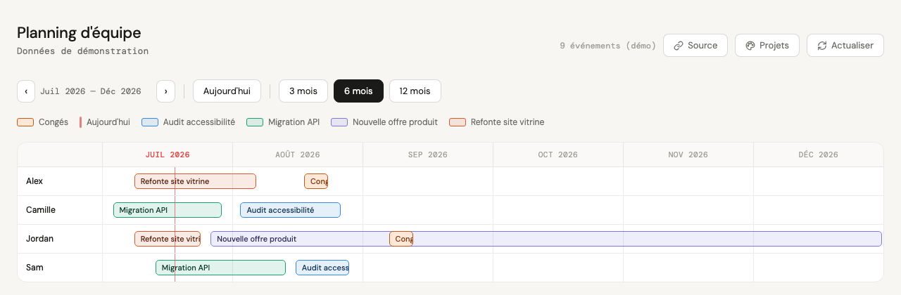
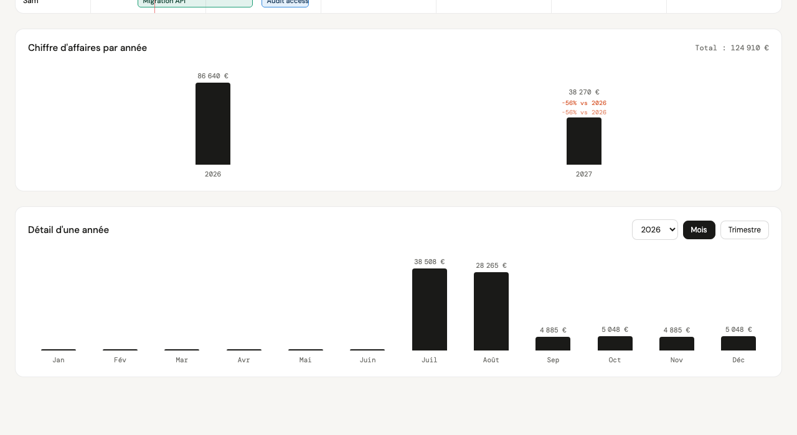

# Planning d'équipe — ICS

Un planning d'équipe en Gantt, en une seule page HTML/CSS/JS sans dépendance ni build. Il lit un flux ICS (calendrier iCalendar standard) et affiche les projets et congés de chaque personne sur une timeline, avec navigation par mois et couleurs personnalisables par projet.



Aucune donnée n'est envoyée à un serveur : l'URL du flux, les couleurs et les budgets choisis restent dans le `localStorage` de votre navigateur. C'est aussi une limite à connaître : ces réglages sont propres à un navigateur et un appareil donnés — changer de navigateur, ouvrir une fenêtre privée ou vider le cache les réinitialise.

**Démo live :** https://msadtp.github.io/ics-team-planning/

## Fonctionnalités

- Timeline par personne, vue 3 / 6 / 12 mois, navigation mois par mois
- Distinction visuelle projets / congés, ligne "aujourd'hui"
- Couleur personnalisable par projet, mémorisée localement
- Budget par projet, avec calcul du chiffre d'affaires par année et par mois/trimestre
- Source de données interchangeable depuis l'interface (pas de config à éditer)
- Données de démonstration au premier chargement, avant même de connecter un vrai calendrier
- Aucune dépendance, aucun build : un seul fichier HTML

## Essayer

Ouvrez `index.html` (double-clic, ou servez le dossier avec n'importe quel serveur statique). Des données de démonstration s'affichent immédiatement, sans configuration.

Pour brancher votre propre calendrier : cliquez sur **Source** en haut à droite, collez l'URL de votre flux ICS, puis **Charger cette source**.

### Où trouver l'URL de votre flux ICS

- **Google Calendar** : Paramètres du calendrier → « Intégrer le calendrier » → copier l'« Adresse secrète au format iCal ».
- **Outlook / Microsoft 365** : Paramètres → Calendrier → Calendriers partagés → « Publier un calendrier » → copier le lien ICS.
- Tout autre calendrier capable d'exporter un flux `.ics` public ou semi-public convient.

### Limite CORS

Un flux ICS n'est pas toujours accessible depuis le navigateur d'un autre domaine : certains fournisseurs n'envoient pas les en-têtes CORS nécessaires. Si le chargement échoue avec une erreur réseau, c'est la cause la plus probable. Solutions possibles : passer par un proxy CORS, ou héberger vous-même une copie du flux (export régulier vers un fichier statique accessible en HTTPS).

## Format attendu des événements

Le résumé (`SUMMARY`) de chaque événement ICS est découpé au premier `>` : la partie avant devient le nom de la personne, celle après le nom du projet.

```
BEGIN:VEVENT
SUMMARY:Camille > Migration API
DTSTART;VALUE=DATE:20260703
DTEND;VALUE=DATE:20260713
END:VEVENT
```

Un événement dont le résumé contient « congé » (insensible à la casse, avec ou sans accent — ex. `Camille > Congés`) est classé comme congé plutôt que comme projet, et affiché avec un style distinct.

## Chiffre d'affaires par projet



Depuis le panneau **Projets**, renseignez un budget total par projet. Ce budget est ensuite réparti au prorata du nombre de jours du projet dans chaque mois calendaire — un projet qui s'étale sur deux années voit son budget partagé entre les deux au prorata exact des jours de chaque côté de la frontière, pas divisé arbitrairement.

Deux graphiques en découlent :

- **Par année** : une colonne par année où au moins un projet a du budget, avec la croissance en % par rapport à l'année précédente et par rapport à la toute première année de données.
- **Détail d'une année** : la même somme éclatée par mois ou par trimestre, pour une année choisie dans le menu déroulant.

Le budget d'un projet couvre l'étendue complète du projet, tous intervenants confondus (du premier jour où il apparaît pour n'importe qui à son dernier jour), pas seulement la plage d'une personne en particulier.

## Déployer

Le fichier est statique : GitHub Pages, Netlify, Vercel ou tout hébergement de fichiers statiques fonctionne sans configuration.

## Licence

MIT.
